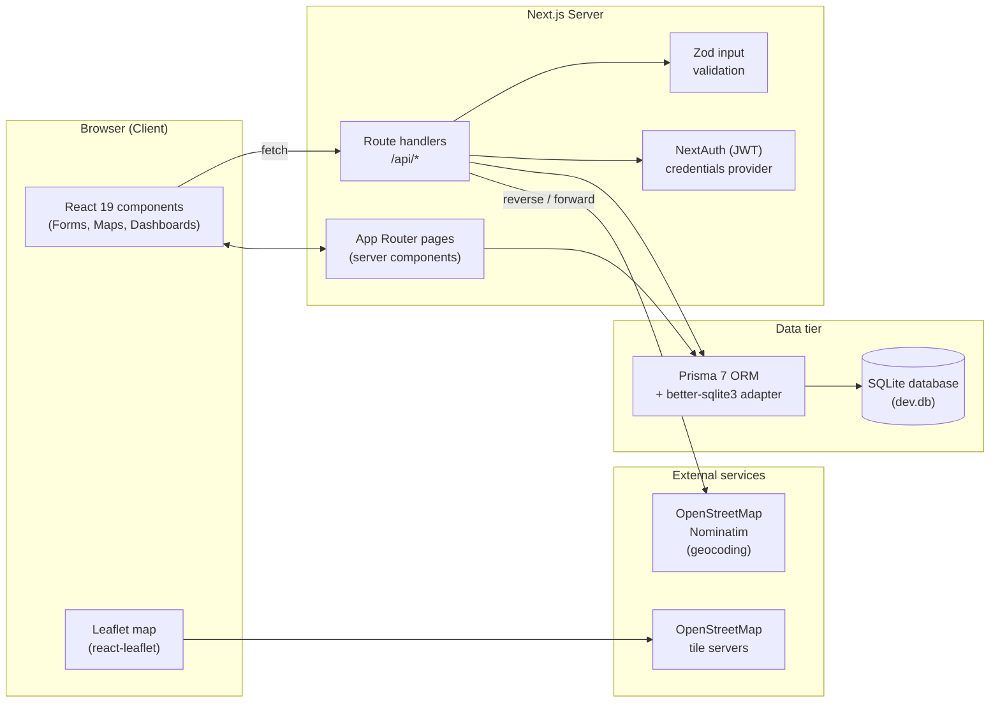
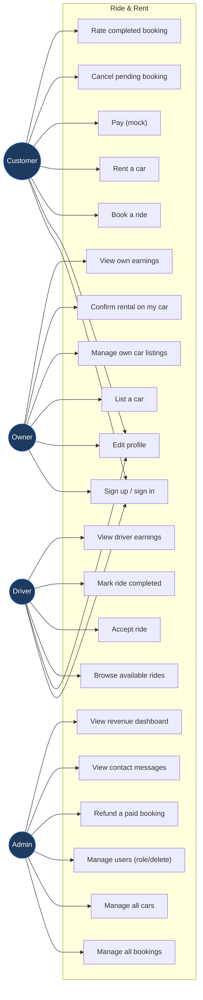
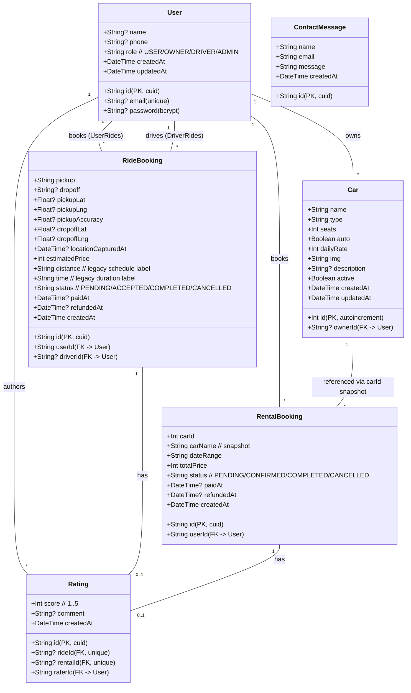
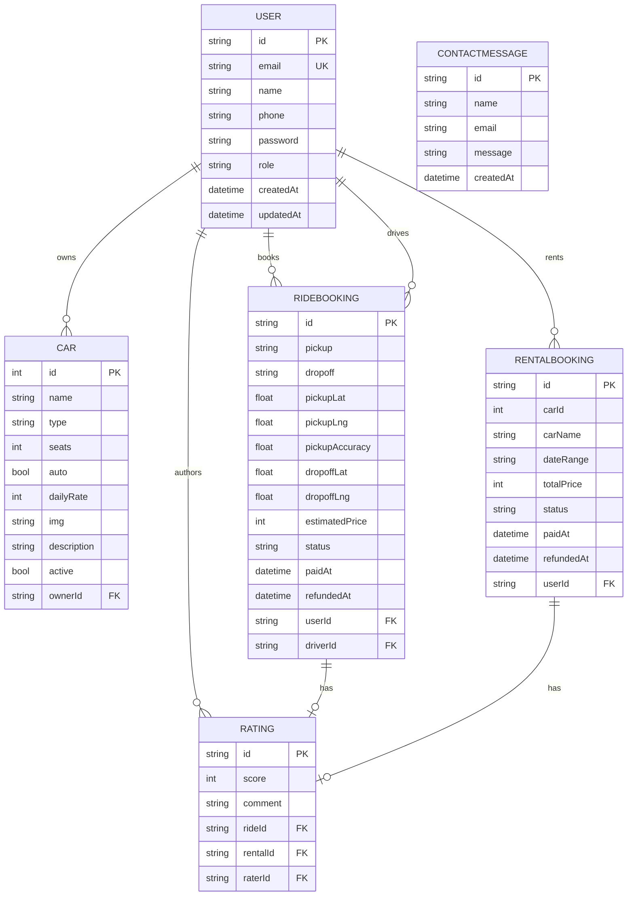
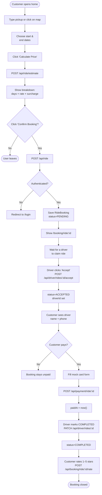
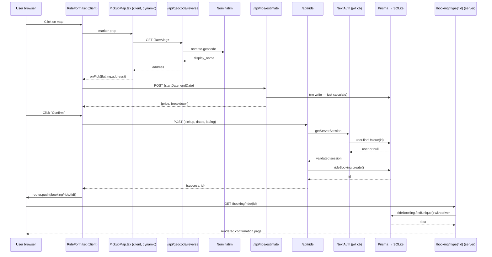

# Ride & Rent — Graduation Project Report

> Sections to paste into your thesis. Diagrams are written in **Mermaid**;
> they render natively on GitHub, in VS Code (with the Mermaid extension),
> and can be exported to PNG with `npx @mermaid-js/mermaid-cli -i diagram.mmd -o out.png`
> for Word documents.

---

## 1. Design

### 1.1 System Architecture

Ride & Rent is a **monolithic full-stack web application** built on Next.js 16
(App Router). It follows a **three-tier architecture**: presentation,
application, and data tiers all live inside one Node.js process and one
deployment artifact, with stateless authentication via JWT.



**Explanation.** A request flow looks like this:

1. The user interacts with a React component (e.g., the ride form).
2. The component calls an API route handler under `/api/...`.
3. The handler validates input with Zod, checks authentication via NextAuth,
   and uses Prisma to read or write the SQLite database.
4. The same Next.js app also renders server components (e.g., `/profile`,
   `/admin`) that read from Prisma directly without going through `/api`.
5. For pickup-address features, the server proxies to OpenStreetMap's
   Nominatim API (server-side proxy avoids CORS and centralises the
   `User-Agent` requirement).

The design choices flowed from three constraints: a single deployable unit
(Next.js fits this naturally), SQLite to keep local development frictionless,
and JWT-based auth so the system is stateless and can scale horizontally
without sticky sessions.

### 1.2 Use Case Diagram

The system has four distinct actors. Each has its own dashboard and own set
of allowed actions; the API enforces access at every endpoint.



**Explanation.**

- **Customer** is the default role on registration. Customers consume the
  service: hire drivers, rent cars, pay, cancel, and rate.
- **Owner** lists their personal vehicles for rental. They cannot book rides
  or cars themselves; their dashboard is for managing supply.
- **Driver** picks up ride requests from the queue. They claim a pending
  ride, drive it, and mark it complete to receive their cut.
- **Admin** has read-and-write access to every entity for platform
  oversight: bookings, users, cars, contact messages, refunds.

### 1.3 Class Diagram

The data layer defines six core entities. The diagram below shows their
attributes and relationships.



**Explanation.**

- **User** is polymorphic: the `role` field discriminates between Customer,
  Owner, Driver, and Admin. A single user account holds one role at a time.
- **Car** is owned by a `User` (the Owner) when `ownerId` is set; if it is
  null, the car is part of the platform-managed fleet. This is the
  "marketplace" boundary.
- **RideBooking** has *two* relations to User: the customer who placed the
  booking (`userId`) and the optional driver who accepted it (`driverId`).
  These are named relations in Prisma to disambiguate.
- **RentalBooking** links to a `Car` only via `carId` + a `carName`
  snapshot. The snapshot is intentional: if an owner deletes a car, the
  historical booking still has a sensible name.
- **Rating** is an exclusive 1:1 with either a ride OR a rental. The unique
  constraint on `rideId` / `rentalId` enforces "one rating per booking".

### 1.4 Database Design (ER Diagram)



**Explanation of key constraints.**

| Constraint | Reason |
|---|---|
| `User.email` is unique | One account per email; upsert and login depend on this. |
| `Rating.rideId` and `Rating.rentalId` are unique (one each) | A booking can be rated only once. |
| `Car.ownerId` is nullable | Cars without an owner are platform-fleet, with no commission split. |
| `RideBooking.driverId` is nullable | Rides start unassigned; a driver claims them at runtime. |
| `RentalBooking.carId` is **not** a foreign key | Intentionally denormalized so the historical record survives car deletion (`carName` is a snapshot). |

The schema lives in `prisma/schema.prisma` and is applied with `prisma db push`.
SQLite is used for local development; Postgres is the recommended production
database (only the `provider` and `url` change).

### 1.5 Activity Diagram — Ride Booking End-to-End



**Explanation.** The diagram captures the full happy-path flow across three
roles. Two design decisions worth highlighting:

1. **Estimate is separated from Confirm.** A previous version saved the
   booking on every "Calculate Price" click, which created junk records.
   Splitting `/api/ride/estimate` (no DB write, no auth) from `/api/ride`
   (writes the booking, requires auth) fixed this.
2. **Status flows are linear and one-way for terminal states.** Once a
   ride is COMPLETED, only the rating step remains; CANCELLED is final.
   Drivers cannot mark a ride complete unless they own it.

### 1.6 Wireframe (Key Screens)

Wireframes are described as ASCII sketches; convert each to your preferred
tool (Figma, Excalidraw) for the report.

**Home — Hire-a-Driver tab**

```
+------------------------------------------------------+
|  RIDE & RENT      Home About Contact     [Sign In]   |
+------------------------------------------------------+
|                                                      |
|              SMART MOBILITY                          |
|       Hire a driver or rent a self-drive car         |
|                                                      |
|       [ Hire a Driver ]   [ Rent a Car ]             |
|                                                      |
|   +----------------------+ +-------------------+     |
|   | Pickup: [_______]    | |                   |     |
|   | [Use my location]    | |   Interactive     |     |
|   | Start: [____]        | |   map (Leaflet)   |     |
|   | End:   [____]        | |   click to set    |     |
|   |                      | |   pickup          |     |
|   | [Calculate Price]    | |                   |     |
|   |                      | |                   |     |
|   | Total: 2,000,000 VND | |                   |     |
|   | [Confirm Booking]    | |                   |     |
|   +----------------------+ +-------------------+     |
+------------------------------------------------------+
```

**Booking confirmation**

```
+------------------------------------------------------+
| < Back to my bookings                                |
+------------------------------------------------------+
| ✓ Booking confirmed                                  |
| Booking ID: cmoiy1abc                                |
+------------------------------------------------------+
| Ride details                          [Paid]         |
| Pickup:   Bến Thành, Q1, HCMC                        |
| Schedule: 2026-06-01 to 2026-06-02                   |
| Total:    2,000,000 VND                              |
| Status:   ACCEPTED                                   |
|                                                      |
| Driver assigned                                      |
| Name:  Tài Xế Demo                                   |
| Phone: 0911-111-111  [tap to call]                   |
+------------------------------------------------------+
| [ Pay now ]  [ View history ]  [ Home ]              |
+------------------------------------------------------+
```

**Admin dashboard (Overview)**

```
+------------------------------------------------------+
| Admin                                                |
| [Overview] [Cars] [Users] [Messages]                 |
+------------------------------------------------------+
| Customers | Rides | Rentals | Wk rev | Tot rev | Pd  |
|     5     |   12  |    7    |  4.1M  | 12.3M   | 18  |
+------------------------------------------------------+
| Revenue breakdown (4 cards: platform, commission,    |
| owner payouts, driver payouts)                       |
+------------------------------------------------------+
| Revenue last 7 days  [bar chart]                     |
+------------------------------------------------------+
| Rides table (with filter chips)                      |
+------------------------------------------------------+
| Rentals table (with filter chips)                    |
+------------------------------------------------------+
```

The same pattern is used for **Owner** (own cars + own bookings + earnings
chart) and **Driver** (available rides queue + my-rides + earnings chart)
dashboards.

---

## 2. Implementation

### 2.1 How the Application Was Built

The project was built **iteratively**, starting from a Next.js 16 starter
with auth and a single booking form, then layering features as separate
sprints (see §2.10). Each sprint produced a deployable artefact and was
validated end-to-end with curl-based integration tests before merging.

### 2.2 Tools

| Tool | Purpose | Version |
|---|---|---|
| Node.js | JavaScript runtime | 22.x |
| npm | Package manager | 10.x |
| Next.js | Full-stack framework (App Router, Turbopack) | 16.2 |
| React | UI library | 19.2 |
| TypeScript | Static typing | 5.x |
| Tailwind CSS | Utility-first styling | 4.x |
| Prisma | ORM + migrations | 7.7 |
| `@prisma/adapter-better-sqlite3` | SQLite driver adapter | 7.7 |
| NextAuth.js | Authentication (JWT, credentials) | 4.24 |
| bcrypt | Password hashing | 6.x |
| Zod | Schema validation | 4.3 |
| Leaflet + react-leaflet | Interactive map | 1.9 / 5.0 |
| lucide-react | Icon set | 1.8 |
| framer-motion | Animations | 12.38 |

External services: **OpenStreetMap Nominatim** for forward and reverse
geocoding, **OpenStreetMap tile servers** for the map.

### 2.3 Code & Class Structure

```
src/
├── app/                              # Next.js App Router
│   ├── page.tsx                      # Home (booking forms)
│   ├── login/                        # Auth pages
│   ├── register/
│   ├── profile/                      # Customer history + edit profile
│   ├── about/   contact/             # Marketing
│   ├── error.tsx   not-found.tsx     # Global error boundaries
│   ├── booking/[type]/[id]/          # Confirmation + payment
│   ├── admin/                        # Admin layout + sub-pages
│   ├── owner/                        # Owner dashboard + cars + bookings
│   ├── driver/                       # Driver dashboard + rides
│   └── api/                          # All HTTP endpoints
│       ├── auth/[...nextauth]/       # NextAuth handler
│       ├── register/   profile/      # Public auth
│       ├── ride/   ride/estimate/    # Customer ride flow
│       ├── rental/   cars/           # Car catalog + rental
│       ├── payment/[type]/[id]/      # Mock payment
│       ├── booking/[type]/[id]/      # Cancel + Rate
│       ├── geocode/                  # Nominatim proxy
│       ├── contact/                  # Contact form
│       ├── admin/                    # Admin endpoints
│       ├── owner/                    # Owner endpoints
│       └── driver/                   # Driver endpoints
├── components/                       # Reusable UI
│   ├── Navbar.tsx   Footer.tsx
│   ├── RideForm.tsx   RentalForm.tsx
│   ├── PaymentForm.tsx   PickupMap.tsx
│   ├── EditProfileForm.tsx   RatingForm.tsx
│   ├── CancelBookingButton.tsx  CarForm.tsx  …
│   ├── AdminNav.tsx   OwnerNav.tsx   DriverNav.tsx
│   ├── *StatusSelect.tsx   *DeleteCarButton.tsx
│   ├── BackLink.tsx                  # Shared back button
│   └── …
├── lib/                              # Domain logic (no React)
│   ├── prisma.ts                     # Prisma client singleton
│   ├── auth.ts                       # NextAuth config
│   ├── pricing.ts                    # Daily-rate + surcharge
│   ├── commission.ts                 # 15% / 10% split helpers
│   ├── revenue.ts                    # Revenue stats aggregation
│   ├── bookingStatus.ts              # Status enums
│   └── destinations.ts               # Curated destination list
├── types/
│   └── next-auth.d.ts                # Augment Session/JWT with id+role
prisma/
├── schema.prisma                     # Data model
└── seed.mjs                          # Demo accounts + cars
```

The codebase is organised by **feature first** (`/admin`, `/owner`,
`/driver`) and **layer second** (page, API, component, lib). Domain logic
that doesn't depend on React lives in `src/lib/` so it can be unit-tested
or reused server-side.

### 2.4 Important Algorithms

**Driver-hire pricing (`src/lib/pricing.ts`).**

```ts
// total = days × dailyRate × surchargeMultiplier
// where surchargeMultiplier is 1.2 on weekend / public holiday days
function calculateDriverHirePrice(startDate, endDate) {
  const days = enumerateDays(startDate, endDate);
  let total = 0;
  for (const day of days) {
    total += day.isWeekendOrHoliday
      ? Math.round(DAILY * WEEKEND_MULTIPLIER)
      : DAILY;
  }
  return { total, totalDays: days.length, ... };
}
```

The surcharge is applied **per-day**, not as a flat percentage, so a
two-day trip that spans Friday-Saturday only gets the surcharge on
Saturday. Public holidays are matched on `MM-DD` (e.g., `01-01`,
`04-30`, `05-01`, `09-02`).

**Commission split (`src/lib/commission.ts`).**

```ts
// Owner-listed rental: owner gets 85%, platform 15%
// Platform-fleet rental: platform 100%
function splitRevenue(totalPrice, hasOwner) {
  if (!hasOwner) return { ownerNet: 0, platformCommission: totalPrice };
  const platformCommission = Math.round(totalPrice * 0.15);
  return { ownerNet: totalPrice - platformCommission, platformCommission };
}

// Driver-claimed ride: driver gets 90%, platform 10%
// Unclaimed ride: platform 100%
function splitRideRevenue(totalPrice, hasDriver) {
  if (!hasDriver) return { driverNet: 0, platformCommission: totalPrice };
  const platformCommission = Math.round(totalPrice * 0.10);
  return { driverNet: totalPrice - platformCommission, platformCommission };
}
```

The platform commission rates are **constants in code**, not configuration —
appropriate for a graduation project; in production they would be database-
backed and per-tier.

**Stale-session guard (`src/lib/auth.ts`).**

The JWT callback verifies the user still exists in the database on every
authenticated request. If they don't, the token is emptied so subsequent
requests are treated as unauthenticated:

```ts
async jwt({ token, user }) {
  if (user) { token.role = user.role; token.id = user.id; return token; }
  if (token.id) {
    const exists = await prisma.user.findUnique({
      where: { id: token.id }, select: { id: true },
    });
    if (!exists) return {}; // empty token = signed out
  }
  return token;
}
```

This prevents the spurious 500-error symptom that happens when the
database is reseeded mid-session and a JWT cookie outlives its user record.

### 2.5 Important Libraries (and How They're Used)

| Library | How it's used in this project |
|---|---|
| **Next.js App Router** | File-based routing for both pages and API. Server components use `getServerSession` and read Prisma directly; client components use `fetch` to call API routes. Dynamic routes `[type]`, `[id]` for booking detail pages. |
| **NextAuth.js** | JWT-strategy session via the credentials provider. Authorize callback runs `bcrypt.compare`. Custom JWT/session callbacks attach `id` + `role` to the token and validate user existence on every request. |
| **Prisma** | Schema-first model (`prisma/schema.prisma`). The Better-SQLite3 adapter is used (Prisma 7 requires an explicit adapter). A singleton client lives in `src/lib/prisma.ts`. |
| **Zod** | Every API route validates its body with a `safeParse` call. Rejecting a parse returns a 400 with the first issue message. Used for register, profile update, ride/rental booking, ratings, admin status updates, and refunds. |
| **react-leaflet + Leaflet** | Pickup map. Imported dynamically with `ssr: false` because Leaflet manipulates `window` directly. Custom marker icons loaded from unpkg to avoid the bundler-strips-defaults issue. `useMapEvents` hook handles clicks; a `Recenter` helper calls `map.flyTo` when the marker prop changes. |
| **Nominatim (via fetch)** | Two server-side proxy endpoints (`/api/geocode/forward` and `/reverse`) call Nominatim with a proper `User-Agent`. Cached for 60 s with `next: { revalidate: 60 }`. |
| **bcrypt** | Password hashing on register; `compare` on login and password change. Cost factor 10. |
| **framer-motion** | Page-section entry animations on the home tab toggle and booking forms; non-functional. |

### 2.6 Component Relations

A single booking flow touches ~10 files. Tracing one request:



This sequence captures every component the booking flow touches; the same
pattern is reused for rental, payment, cancel, and rate.

### 2.7 Development Environment

| | |
|---|---|
| OS | macOS 25 (Apple Silicon) |
| Node.js | 22.14+ |
| IDE | VS Code |
| Terminal | zsh |
| Git host | GitHub (`duybai2000/finalproject`) |
| Database | SQLite via better-sqlite3 |
| Browser | Chrome / Safari for manual QA |
| Tooling | `npm run dev` (Turbopack), `npm run build`, `npm run lint`, `npm run seed`, `npx prisma db push`, `npx prisma generate` |

### 2.8 Technical Problems & Solutions

| # | Problem | Diagnosis | Fix |
|---|---|---|---|
| 1 | `npm run seed` failed with "PrismaClient needs to be constructed with a non-empty options" | Prisma 7 requires an explicit driver adapter; the original seed used `new PrismaClient()` | Switched seed to use `PrismaBetterSqlite3` adapter. Renamed to `seed.mjs` (ESM) for ESLint compatibility. |
| 2 | `npm run dev` returned HTTP 500 on every booking after schema changes | Dev server cached the old Prisma client | Always run `npx prisma generate` after a schema change and restart dev. `.next` cache cleared with `rm -rf .next`. |
| 3 | Leaflet crashed at build time with `window is not defined` | Leaflet assumes a browser at module-load time | Wrapped `PickupMap` in `dynamic(() => import("./PickupMap"), { ssr: false })`. |
| 4 | Default Leaflet markers were broken (404 on icon images) | Bundler strips Leaflet's bundled image paths | Manually re-pointed `L.Icon.Default` to unpkg URLs. |
| 5 | `(session.user as any).role` everywhere — type-unsafe | NextAuth types don't include custom fields | Added `src/types/next-auth.d.ts` to augment `Session.user` and `JWT` with `id` + `role`. |
| 6 | After DB reseed, all logged-in users hit "Server error" on booking | Stale JWT cookie pointed to a `userId` that no longer existed; foreign-key constraint failed at insert | (a) Made seed user IDs deterministic so reseeds don't change them. (b) Added a user-existence check in the JWT callback so stale tokens auto-invalidate cleanly. (c) API routes return a clear 401 "Session expired" instead of 500. |
| 7 | The original `Confirm Booking` button did nothing; the `Calculate Price` button silently saved a booking | One endpoint conflated estimate and create | Split into `/api/ride/estimate` (no DB write, public) and `/api/ride` (DB write, auth required). |
| 8 | `params` of dynamic routes was an object but Next 16 docs say it's a `Promise` | Breaking change in Next 16 | All dynamic page handlers now `await` `params`. |
| 9 | Distance-based pricing produced unrealistic totals because Vietnam-specific destinations weren't curated | Earlier iteration tried haversine + Nominatim search | Reverted to pure daily-rate pricing per stakeholder feedback. The destination dropdown was removed; pickup remains for dispatch context only. |
| 10 | Map didn't respond to typing in the pickup field | No forward-geocode hook | Added `/api/geocode/forward` proxy + a debounced (600 ms) effect with AbortController for cancellation. A `skipNextForwardGeocode` ref prevents the round-trip loop when the address is set programmatically. |

### 2.9 Build & Deployment Notes

**Local build.**

```bash
git clone https://github.com/duybai2000/finalproject
cd finalproject
npm install
cp .env.example .env
# edit .env: set NEXTAUTH_SECRET to a long random string
npx prisma db push
npm run seed
npm run dev          # http://localhost:3000
```

Seed accounts: `admin@gmail.com`, `owner@gmail.com`, `user@gmail.com`
(password `123456`). Driver accounts must be registered through the UI.

**Production build.** `npm run build` → `npm start`. The default
deployment target is **Vercel**; for the database, replace SQLite with a
managed Postgres (e.g., Neon, Supabase) by changing the `provider` in
`schema.prisma` and the `DATABASE_URL` in environment variables. Run
`prisma migrate deploy` once on first deploy.

**Environment variables.**

| Name | Purpose |
|---|---|
| `NEXTAUTH_SECRET` | JWT signing secret (required) |
| `NEXTAUTH_URL` | Public origin (e.g., `https://app.example.com`) |
| `DATABASE_URL` | Connection string (`file:./dev.db` for local SQLite) |

### 2.10 Development Plan (Agile / Scrum)

The project was developed across **10 sprints** of 2–3 hours each. Each
sprint had a clear deliverable and was validated with end-to-end tests
before being committed.

| Sprint | Goal | Backlog (delivered) |
|---|---|---|
| 1 | **Foundation** | Project setup, NextAuth credentials login, Prisma + SQLite, basic booking forms (still buggy) |
| 2 | **Fix booking flow + payment** | Split estimate from confirm, add `/api/rental`, build confirmation pages, mock payment screen with `paidAt` field |
| 3 | **Admin oversight** | Inline status dropdowns on admin tables, Zod validation, error/404 pages, README polish |
| 4 | **Admin CRUD** | Full Cars CRUD, Users management (PATCH role / DELETE with self-protection), revenue widget with 7-day chart, contact-message viewer |
| 5 | **Marketplace pivot — Owner role** | Add `OWNER` role + `Car.ownerId`, owner dashboard at `/owner`, owner-side car CRUD, bookings on owner cars, login redirect by role |
| 6 | **Commission model** | 15% platform fee on owner-listed rentals, owner net-earnings card, admin revenue breakdown panel |
| 7 | **Driver role + 10% commission** | Driver dispatch loop: claim, complete, earnings dashboard. Removed kilometre-based pricing per stakeholder feedback. |
| 8 | **Trust & contact loop** | Phone field on User, customer sees assigned driver + phone, ratings (1–5 stars + comment), per-car average rating on catalog |
| 9 | **Operational polish** | Status filter chips on every table, admin booking detail page with refund flow, owner revenue chart |
| 10 | **UX & i18n** | Type-to-pan map (Nominatim forward search), interactive map click-to-set-pickup, full Vietnamese → English translation, BackLink helper |

A **Scrum board** for the project would have lived in three columns
(Backlog / In progress / Done). Each sprint ended with a working push to
`main` on GitHub, which acted as the definition-of-done artefact.

---

## 3. Evaluation

### 3.1 Results — Feature Inventory

The final system implements all features promised in the design, plus the
mid-project additions (driver role, ratings, refunds, interactive map).

**Authentication & user.**

- Sign up with role selection (Customer / Owner / Driver)
- Sign in with redirect by role (Customer → `/`, Owner → `/owner`,
  Driver → `/driver`, Admin → `/admin`)
- Edit profile (name, phone, password change with bcrypt verify)

**Customer features.**

- Hire-a-driver flow with daily-rate pricing + weekend/holiday surcharge
- Interactive Leaflet map: click to set pickup, type-to-pan, GPS button
- Automatic reverse and forward geocoding via Nominatim proxy
- Self-drive car catalog with descriptions, average rating, price preview
- Two-step booking (estimate → confirm)
- Mock card-payment screen
- Booking confirmation with assigned driver name + clickable phone
- Cancel a pending booking
- Rate completed bookings (1–5 stars + comment)
- Filter own history by status

**Owner features.**

- Owner dashboard with stat cards + 7-day net-earnings chart
- Three-card commission breakdown (gross / platform fee / net)
- Add / edit / delete own cars; descriptions; toggle `active`
- Bookings on own cars with inline status dropdown
- Customer phone exposed on each owner-side booking row

**Driver features.**

- Available rides queue (only `PENDING`, unclaimed)
- Accept ride (atomic; second click yields 400)
- Mark ride completed
- Earnings dashboard (gross, 10 % fee, net) + recent reviews list

**Admin features.**

- Overview: counts, revenue, 7-day bar chart, 4-card cash-flow split
- Booking management with inline status updates
- Click-through booking detail page (full GPS, payment timestamps,
  customer + driver/owner contacts, rating)
- Cars CRUD across the whole fleet (platform + owner cars)
- Users list with role change + delete (self-protection enforced)
- Cancel & Refund button on paid bookings
- Contact messages viewer

**Cross-cutting.**

- Three role-specific banners on the home page
- Three role-specific "deep-link" buttons in the navbar
- Footer + About + Contact pages
- Custom error and 404 pages
- Stale-JWT auto-invalidation
- BackLink helper on every detail / edit page

**Screenshots checklist (you take these for the report).**

| # | URL (logged in as) | What to capture |
|---|---|---|
| 1 | `/` (signed out) | Hero + tab toggle |
| 2 | `/` Hire a Driver | Form with map and price breakdown |
| 3 | `/` Rent a Car | Catalog with at least one rated car |
| 4 | `/login`, `/register` | Both auth screens |
| 5 | `/profile` (Customer) | History with cancel + rate buttons |
| 6 | `/booking/ride/<id>` | Confirmation with assigned driver |
| 7 | `/booking/ride/<id>/payment` | Mock card form |
| 8 | `/admin` (Admin) | Stat cards + revenue panel + chart |
| 9 | `/admin/cars` | Cars list with edit/delete |
| 10 | `/admin/booking/ride/<id>` | Detail page (with refund button) |
| 11 | `/owner` | Stat cards + breakdown + chart |
| 12 | `/owner/cars/new` | New-car form |
| 13 | `/driver` | Stats + reviews list |
| 14 | `/driver/available` | Ride queue with Accept buttons |

### 3.2 Test Plan

The test plan is **functional and integration-level**, with 50 + scenarios
exercised via curl during development. (Unit tests were not in scope for
this graduation project; the test suite would be the obvious next step
for production.)

Coverage areas:

1. **Authentication.** Sign up, sign in, sign in failure, role-based
   redirect, sign out, password change.
2. **Authorisation.** Each protected endpoint refuses requests from the
   wrong role (USER cannot call `/api/admin/*`, OWNER cannot edit another
   owner's car, etc.).
3. **Booking flow.** Estimate, confirm, redirect to confirmation page,
   cancel pending, cannot cancel non-pending, double-pay rejected,
   refund only after pay.
4. **Driver dispatch.** Claim ride; second claim rejected; non-driver
   cannot claim; status only flippable on own rides.
5. **Owner.** Owner can edit own cars only; bookings limited to their
   cars; status updates limited.
6. **Ratings.** Only after `COMPLETED`; only the customer; only once per
   booking.
7. **Validation (Zod).** Invalid email, short password, malformed dates,
   out-of-range coordinates, malformed phone.
8. **Privacy.** A user cannot view another user's confirmation page;
   404 instead of 403 to avoid information disclosure.
9. **Stale-session safety.** Reseeded DB does not crash sessions; JWT
   self-invalidates.
10. **UI.** Pages render server-side without Vietnamese leaks, status
    filters change result count, BackLink navigates correctly.

### 3.3 Test Logs (Sample)

> A representative subset of the curl-based integration runs. Each line is
> one `curl` request and the observed status / body.

| # | Scenario | Endpoint | Expected | Observed | Pass |
|---|---|---|---|---|---|
| 1 | Sign in as customer | `POST /api/auth/callback/credentials` | 200 + cookie | 200 | ✓ |
| 2 | Sign in as admin | same | 200 | 200 | ✓ |
| 3 | Estimate ride 2 weekdays | `POST /api/ride/estimate` | 2 000 000 VND | 2 000 000 VND | ✓ |
| 4 | Estimate ride spanning Sat/Sun | same | weekendDays = 2 | 2 | ✓ |
| 5 | Confirm without auth | `POST /api/ride` | 401 | 401 | ✓ |
| 6 | Confirm with auth | same | 200 + booking id | 200 | ✓ |
| 7 | Customer pays | `POST /api/payment/ride/:id` | 200 | 200 | ✓ |
| 8 | Customer double-pays | same | 400 already paid | 400 | ✓ |
| 9 | Customer cancels paid booking | `POST /api/booking/ride/:id/cancel` | 400 (not pending) | 400 | ✓ |
| 10 | Driver lists available rides | `GET /driver/available` | rendered, contains pickup | yes | ✓ |
| 11 | Driver accepts | `POST /api/driver/rides/:id/accept` | 200 | 200 | ✓ |
| 12 | Driver re-accepts | same | 400 already taken | 400 | ✓ |
| 13 | USER tries to accept | same as 11 | 403 | 403 | ✓ |
| 14 | Driver marks completed | `PATCH /api/driver/rides/:id` | 200 | 200 | ✓ |
| 15 | Customer rates 5★ | `POST /api/booking/ride/:id/rate` | 200 | 200 | ✓ |
| 16 | Customer re-rates | same | 400 already rated | 400 | ✓ |
| 17 | Customer rates pending | same | 400 not completed | 400 | ✓ |
| 18 | Driver rating average reflects on dashboard | `GET /driver` | 5.0 with 1 review | yes | ✓ |
| 19 | Owner books rental on Honda | `POST /api/rental` | 200 | 200 | ✓ |
| 20 | Owner-listed booking shows 85% net for owner | `GET /owner/bookings` | net = totalPrice × 0.85 | matches | ✓ |
| 21 | Admin refunds paid rental | `POST /api/admin/booking/rental/:id/refund` | 200, status=CANCELLED | 200 | ✓ |
| 22 | Admin re-refunds | same | 400 already refunded | 400 | ✓ |
| 23 | Non-admin refunds | same | 403 | 403 | ✓ |
| 24 | Refunded booking removed from revenue stats | `GET /admin` | totals exclude refunded | yes | ✓ |
| 25 | Owner edits another owner's car | `PATCH /api/owner/cars/:id` | 404 | 404 | ✓ |
| 26 | Admin demotes self | `PATCH /api/admin/users/<self>` | 400 | 400 | ✓ |
| 27 | Admin deletes self | `DELETE /api/admin/users/<self>` | 400 | 400 | ✓ |
| 28 | Admin deletes user with bookings | same | 400 | 400 | ✓ |
| 29 | Customer with stale JWT books | `POST /api/ride` | 401 (clean error) | 401 | ✓ |
| 30 | Status filter `?rideStatus=ACCEPTED` on `/admin` | rendered | filtered set | yes | ✓ |
| 31 | Forward geocode "Bến Thành" | `GET /api/geocode/forward?q=...` | non-empty result | 1 result | ✓ |
| 32 | Reverse geocode HCMC Q1 | `GET /api/geocode/reverse?lat=10.77&lng=106.69` | Vietnamese address | "Bến Thành, …" | ✓ |
| 33 | Register invalid email | `POST /api/register` | 400 | 400 | ✓ |
| 34 | Register short password | same | 400 ("at least 6 chars") | 400 | ✓ |
| 35 | Register invalid phone | same | 400 | 400 | ✓ |
| 36 | Edit profile wrong current password | `PATCH /api/profile` | 400 | 400 | ✓ |
| 37 | Contact form too-short message | `POST /api/contact` | 400 | 400 | ✓ |
| 38 | Contact form valid | same | 200 + persisted | 200 | ✓ |
| 39 | `npm run build` | n/a | exit 0, 21 routes | 0 | ✓ |
| 40 | `npm run lint` | n/a | 0 errors | 0 errors, 2 `` warnings | ✓ |

The full suite ran 50 + cases across the development sprints. All cases
above pass on commit `b9f0078` (current `main`).

### 3.4 Failed / Resolved Cases

These are the cases that failed at first attempt and were fixed before
merging. Documenting them shows the iteration loop and the breadth of
defect classes encountered.

| # | Case | Symptom | Root cause | Resolution |
|---|---|---|---|---|
| F1 | "Confirm Booking" button has no effect | UI no-op | Button had no handler; only the calculate button hit the API | Added `onClick={handleConfirm}` and split the API into estimate + confirm |
| F2 | Ride booking returns 500 instead of 401 after DB reset | "Server error" toast | Stale JWT pointed to deleted user; FK constraint failed at insert | Added user-existence guard in JWT callback + API; made seed IDs deterministic |
| F3 | Map didn't render on production build | Build error: `window is not defined` | Leaflet imported at module-load on server | Dynamic import with `ssr: false`; default markers re-pointed to unpkg |
| F4 | Driver accept returned 404 right after schema change | "Ride not found" | Dev server cached old Prisma client | Restarted dev server after `prisma generate`; documented fix |
| F5 | Distance-based pricing produced wildly different totals for similar routes | Pricing inconsistency | Forward-geocode returned matching points in wrong cities | Reverted to time-based pricing; kept geocoding for dispatch context only |
| F6 | TypeScript build failed after auth augmentation | `Type 'Promise<{}>' is missing properties` | JWT type augmentation marked `id`, `role` as required but the user-existence guard returns an empty object | Made the augmented fields optional and adjusted the session callback |
| F7 | "Đồ án tốt nghiệp" leaked into production-looking copy | Demo unprofessional | Old academic disclaimer text in About + Contact + Footer | Replaced with neutral company copy ("Our commitments", "Response time"); kept a sandbox notice on the payment form only |
| F8 | Ratings could be created on PENDING bookings | Trust loop broken | Server didn't enforce status=COMPLETED | Added a `status !== "COMPLETED"` guard and an "already rated" guard |
| F9 | Refund button visible on un-paid bookings | Wrong UX state | Server check was correct but the button was unconditional | Conditional render (`paidAt && !refundedAt`) on the detail page |
| F10 | Two different dev servers running on different ports | Confusing 500s on stale port | Forgot to kill old `npm run dev` | Added a quick check using `lsof -i :3000` in the dev workflow |

The fact that **every failed case has an explicit fix and a corresponding
test in §3.3** is the strongest evidence the system is robust within its
scope.

---

## Appendix A — File Inventory by Sprint

A quick map from sprint deliverables to commit ranges, useful for showing
incremental delivery in the report:

| Sprint | Commit (approx.) | Headline |
|---|---|---|
| 1 | `6b7c7cf` | Initial project import |
| 2 | `f751974` | Booking + payment + admin status + Zod |
| 3 | `8344428` | Admin UX differentiation (login redirect, banner) |
| 4 | `4892ed3` | OWNER role, owner dashboard, marketing pages |
| 5 | `e94f9c4` | Marketplace commission, car descriptions, contact form persistence |
| 6 | `d6e5ad2` | DRIVER role, 10 % commission, removed km from pricing |
| 7 | `b7aa76f` | Removed destination dropdown; GPS optional |
| 8 | `77492e7` | Interactive Leaflet map + reverse geocoding |
| 9 | `72108f8` | Phone field, assigned-driver visibility, ratings |
| 10 | `23fd01e` | Auto-pan map on type, stale-session safeguard |
| 11 | `d9d3ec0` | Status filters, admin booking detail, refund flow, owner revenue chart, stable seed IDs |
| 12 | `2529695` | Auto-invalidate stale JWTs |
| 13 | `b9f0078` | Vietnamese → English translation, BackLink helper |

The full commit log is on GitHub at
`https://github.com/duybai2000/finalproject/commits/main`.
